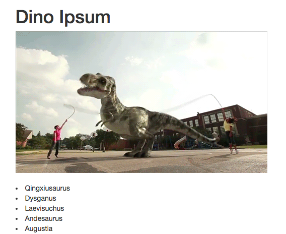

# _Dinosaur Lorem Ipsum_

##### Dinosaur Lorem Ipsum! 03/22/2018

## By Hannah Lee and Maggie Summers

# Description

An application that demonstrates JavaScript API call and asynchrony.

## Behavior

| Spec | Input | Output |
| :---------------| :---------------| :---------------|
| Returns a list of dinosaur themed lorem ipsum text and a dinosaur giphy. | Click button | Qingxiusaurus, Dysganus, Laevisuchus |

<kbd></kbd>

## Technologies Used
------------

```
Application: JavaScript, jQuery, Bootstrap, HTML
Testing: Jasmine, Karma
Environment: npm, webpack, babel, esLint
API: Giphy and Dino Ipsum
```

Installation
------------

```
$ git clone https://github.com/...
```

_Requires node.js; instructions to install:_ https://www.learnhowtoprogram.com/javascript/getting-started-with-javascript-2f9a73dc-b7f5-4a22-9101-e69d49f552ac/installing-node-js

Install required npm packages and dependencies:

```
$ npm install
$ npm run build
```

Start the webserver:
```
$ npm run start
```

## Known Bugs

 * _No known bugs at this time._

## Support and contact details

 _To suggest changes, submit a pull request in the GitHub repository._

### License

 _Licensed under MIT license_
-------

GNU GPL v2. Copyright 2018 **Hannah Lee and Maggie Summers**
